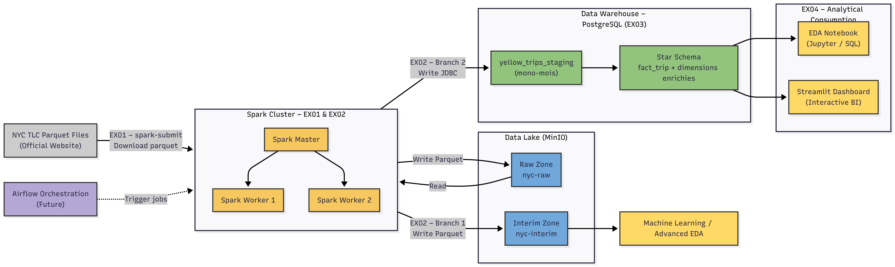

# NYC Taxi Big Data Pipeline

[]()
[]()
[]()
[]()
[]()
[]()
[]()
[]()

Pipeline Big Data complet pour l'analyse des données NYC Taxi, depuis la collecte jusqu'à l'exploitation analytique et le Machine Learning.

Le projet repose sur une **infrastructure Big Data distribuée** basée sur **Spark, MinIO et PostgreSQL**, entièrement orchestrée via **Docker Compose**.



---

## Table des matières

- [Architecture](#architecture)
- [Stack technique](#stack-technique)
- [Structure du projet](#structure-du-projet)
- [Pré-requis](#pré-requis)
- [Installation](#installation)
- [Exercices](#exercices)
- [État du projet](#état-du-projet)
- [Auteur](#auteur)

---

## Architecture

L'infrastructure est conçue pour respecter les contraintes suivantes :

- Exécution exclusivement dans des **conteneurs Linux**
- Aucune dépendance à une installation Spark locale
- Compatibilité avec une orchestration via **Airflow**
- Stockage persistant sur **SSD externe**

### Spark Cluster

Cluster Spark distribué déployé via Docker Compose :

| Composant | Description |
|-----------|-------------|
| Spark Master | Coordinateur du cluster |
| Spark Workers (x2) | Nœuds d'exécution |
| Versions | Spark 3.5.x, Scala 2.13.x, Java 8 |

**Interfaces :**

| Service | URL |
|---------|-----|
| Spark Master UI | http://localhost:8081 |
| Spark Worker 1 | http://localhost:8082 |
| Spark Worker 2 | http://localhost:8083 |

### MinIO – Data Lake (S3 compatible)

MinIO est utilisé comme Data Lake S3-compatible.

| Bucket | Zone | Description |
|--------|------|-------------|
| `nyc-raw` | Raw Zone | Données brutes |
| `nyc-interim` | Interim Zone | Données nettoyées |
| `nyc-processed` | Curated Zone | Données finales |

**Interfaces :**

| Service | URL |
|---------|-----|
| Console MinIO | http://localhost:9001 |
| API S3 | http://localhost:9000 |

### PostgreSQL – Data Warehouse

PostgreSQL est utilisé comme Data Warehouse relationnel.

| Paramètre | Valeur |
|-----------|--------|
| Host | localhost |
| Port | 5432 |
| Base | nyc_dw |

---

## Stack technique

| Catégorie | Technologies |
|-----------|--------------|
| Traitement distribué | Apache Spark 3.5.x |
| Langage Spark | Scala 2.13.x |
| Data Lake | MinIO (S3 compatible) |
| Data Warehouse | PostgreSQL |
| Machine Learning | PySpark MLlib |
| Visualisation | Streamlit, Jupyter |
| Orchestration | Apache Airflow |
| Conteneurisation | Docker, Docker Compose |

---

## Structure du projet

```
.
├── Docker/                     # Dockerfiles et configuration Spark
├── Documents/                  # Documentation et diagrammes d'architecture
├── data/                       # Data Lake local
│   ├── raw/                    # Données brutes
│   ├── interim/                # Données intermédiaires
│   ├── processed/              # Données traitées
│   └── external/               # Données externes
├── ex01_data_retrieval/        # Collecte des données NYC Taxi (Scala/Spark)
├── ex02_data_ingestion/        # Ingestion et nettoyage (Scala/Spark)
├── ex03_sql_table_creation/    # Création du Data Warehouse (SQL)
├── ex04_dashboard/             # Visualisation et dashboard (Streamlit)
├── ex05_ml_prediction_service/ # Service de prédiction ML (PySpark)
├── ex06_airflow/               # Orchestration Airflow
├── docker-compose.yml
└── README.md
```

Les **données ne sont pas versionnées** dans Git (seule la structure des dossiers est conservée).

---

## Pré-requis

- Docker Desktop (WSL2 activé)
- Git
- PowerShell
- Connexion Internet

---

## Installation

### 1. Cloner le dépôt

```bash
git clone https://github.com/AhmedMaaouia1/nyc-taxi-bigdata-pipeline.git
cd nyc-taxi-bigdata-pipeline
```

### 2. Configurer l'environnement

Créer le fichier `.env` à partir du template :

```powershell
Copy-Item .env.example .env
```

Exemple de configuration :

```env
PROJECT_ROOT=S:/PROJECTS/projects/nyc-taxi-bigdata-pipeline
DOCKER_VOLUMES_ROOT=S:/PROJECTS/docker/volumes

MINIO_ROOT_USER=minioadmin
MINIO_ROOT_PASSWORD=minioadmin123

POSTGRES_DB=nyc_dw
POSTGRES_USER=nyc_user
POSTGRES_PASSWORD=nyc_password
```

### 3. Lancer l'infrastructure

```powershell
docker compose up -d
```

### 4. Vérifications

- Spark Master et Workers visibles dans l'UI
- Console MinIO accessible
- PostgreSQL opérationnel

---

## Exercices

### Ex01 – Data Retrieval

Collecte initiale des données NYC Yellow Taxi et intégration dans le Data Lake.

- **Dataset** : NYC Yellow Taxi – 2023
- **Source** : NYC Taxi & Limousine Commission (TLC)
- **Stockage local** : `data/raw/yellow/2023/`
- **Stockage MinIO** : `s3a://nyc-raw/yellow/2023/`

### Ex02 – Data Ingestion

Ingestion multi-branche avec nettoyage et transformation des données.

- Écriture Parquet vers MinIO (Interim Zone)
- Écriture JDBC vers PostgreSQL (Staging)

### Ex03 – SQL Table Creation

Création du Data Warehouse avec schéma en étoile.

- Tables de staging
- Schéma dimensionnel (fact_trip + dimensions)
- Scripts d'indexation et de chargement

### Ex04 – Dashboard

Analyse exploratoire et visualisation interactive.

- Notebooks Jupyter pour l'EDA
- Dashboard Streamlit interactif

### Ex05 – Machine Learning

Service de prédiction ML pour l'estimation des tarifs de courses.

- Pipeline PySpark MLlib
- Entraînement et validation du modèle
- Tests de qualité et de plausibilité
- Application Streamlit de prédiction

### Ex06 – Airflow

Orchestration du pipeline complet via Apache Airflow.

- DAG principal : `full_nyc_taxi_pipeline`
- **Période traitée** : Janvier à Mai 2023 (5 mois)
- Schedule : `@monthly` avec backfill activé
- SLA sur tâches critiques
- Vérification qualité inter-étapes (seuil 80%)
- Tests unitaires des DAGs

---

## État du projet

| Exercice | Description | Statut |
|----------|-------------|--------|
| Infrastructure | Docker Spark/MinIO/PostgreSQL | ✅ Terminé |
| Ex01 | Data Retrieval | ✅ Terminé |
| Ex02 | Data Ingestion | ✅ Terminé |
| Ex03 | SQL Table Creation | ✅ Terminé |
| Ex04 | Dashboard | ✅ Terminé |
| Ex05 | Machine Learning | ✅ Terminé |
| Ex06 | Airflow Orchestration | ✅ Terminé |

---

## Stack

<p align="center">
  
  
  
  
  
  
  
  
  
</p>

---

## Auteur

**MAAOUIA Ahmed**  
Projet réalisé dans le cadre du cours Big Data – CY Tech
